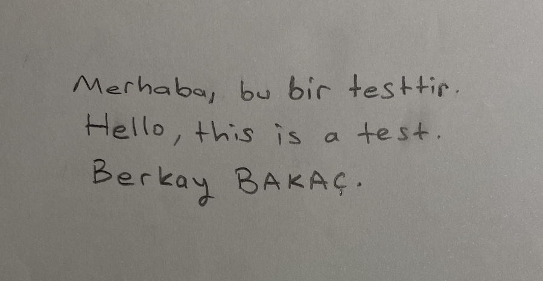

# 🖋️ Handwriting Text Recognition using OpenCV and Tesseract

This project focuses on recognizing handwritten Turkish and English text from images using classical image processing techniques and the Tesseract OCR engine — without deep learning.

---

## 🎯 Project Goal

- Convert handwritten text into digital form using **traditional computer vision techniques**.
- Avoid deep learning dependency while still achieving high OCR accuracy.
- Support both **Turkish and English** language recognition in real-world handwriting samples.

---

## 🛠️ Technologies Used

- 🐍 Python 3.11.4  
- 📷 OpenCV for image preprocessing  
- 🧠 Tesseract OCR with `tur+eng` language configuration  
- 📊 Pandas for calculating average confidence scores  

---

## ⚙️ OCR Pipeline Overview

1. **Load image** and convert to grayscale.
2. Apply **Gaussian Blur** to reduce noise.
3. Apply **Adaptive Thresholding** to binarize image.
4. Use **Morphological operations** (erode, dilate) to clarify text regions.
5. Extract text using `pytesseract.image_to_string`.
6. Clean output with **Regex**, preserving punctuation.
7. Calculate average confidence using `pytesseract.image_to_data`.

> PSM 11 (Sparse Text) and PSM 6 (Single Block) were tested based on text layout.

---

## 🧪 Sample Input

### 📝 Original Input Image (`berkay.png`)

---

## 🖼️ Output Samples

| Output Type        | Description                         |
|--------------------|-------------------------------------|
| `annotated_image.png` | Green boxes around recognized characters |
| `final_processed.png` | Binary image after preprocessing |
| `recognized_text.txt` | Cleaned OCR result in text format |

---

## 📊 Accuracy Results

| Image         | Language     | Accuracy (%) | Parameters Used                |
|---------------|--------------|---------------|--------------------------------|
| berkay.png    | Turkish/English | 84.15         | Default config                 |
| english1.png  | English      | 94.74         | Default config                 |
| english2.png  | English      | 95.50         | Default config                 |
| english3.png  | English      | 93.93         | Default config                 |
| english4.png  | English      | 88.61         | `--psm 6`                      |
| türkçe1.png   | Turkish      | 95.72         | GaussianBlur(21x21) / PSM 6    |
| türkçe2.png   | Turkish      | 90.98         | GaussianBlur(21x21)            |
| türkçe3.png   | Turkish      | 95.70         | Default config                 |
| türkçe4.png   | Turkish      | 95.76         | Default config                 |

> Accuracy is based on Tesseract's confidence scores. Output was manually verified.

---

## 🧩 Why Tesseract?

- **EasyOCR** was initially tested but performed poorly on mixed-script handwritten texts.
- **Tesseract** yielded more stable and reliable results on both Turkish and English handwritten samples.

---

## 🚧 Challenges & Solutions

| Challenge                                  | Solution                                      |
|-------------------------------------------|-----------------------------------------------|
| Low confidence scores in long/messy texts | Used `--psm 6` for block mode segmentation     |
| Noisy input images                        | Increased GaussianBlur kernel to 21x21        |
| Hyphenated line breaks                    | Merged split words using regex cleanup        |

---

## 🔍 Key Parameters

- `--psm 11`: Sparse text (default)
- `--psm 6`: Single block of text
- `--oem 1`: LSTM OCR Engine (recommended)
- Languages: `-l tur+eng`

---

## 🧾 License

This project is licensed under the **MIT License**.

---

## 🌐 Live Portfolio Link

[berkaybakac.github.io](https://berkaybakac.github.io)
